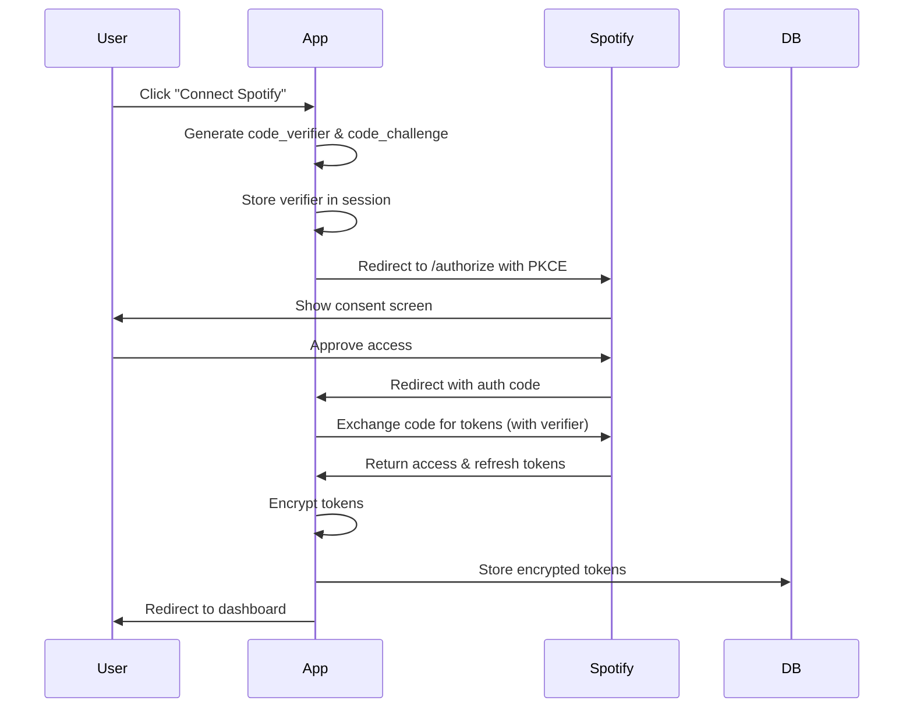
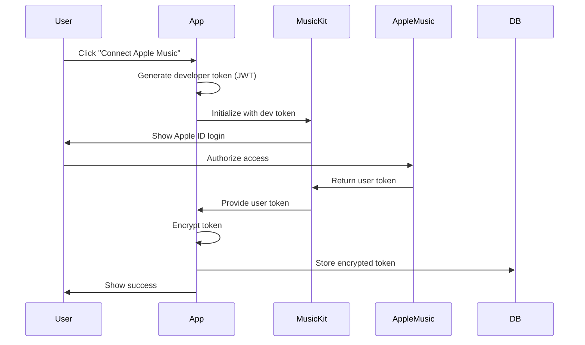

# API Integration Plan

## Overview
Dual-provider OAuth implementation with secure token management and automatic refresh.

## Authentication Flow

### Spotify OAuth (PKCE)



### Apple Music Authorization



## Token Management

### Storage Strategy
```typescript
// lib/crypto.ts
import { createCipheriv, createDecipheriv, randomBytes } from 'crypto';

const algorithm = 'aes-256-gcm';
const key = Buffer.from(process.env.ENCRYPTION_KEY!, 'hex');

export function encryptToken(token: string): string {
  const iv = randomBytes(16);
  const cipher = createCipheriv(algorithm, key, iv);
  
  let encrypted = cipher.update(token, 'utf8', 'hex');
  encrypted += cipher.final('hex');
  
  const authTag = cipher.getAuthTag();
  
  return iv.toString('hex') + ':' + authTag.toString('hex') + ':' + encrypted;
}

export function decryptToken(encryptedToken: string): string {
  const parts = encryptedToken.split(':');
  const iv = Buffer.from(parts[0], 'hex');
  const authTag = Buffer.from(parts[1], 'hex');
  const encrypted = parts[2];
  
  const decipher = createDecipheriv(algorithm, key, iv);
  decipher.setAuthTag(authTag);
  
  let decrypted = decipher.update(encrypted, 'hex', 'utf8');
  decrypted += decipher.final('utf8');
  
  return decrypted;
}
```

### Token Refresh Logic

```typescript
// lib/providers/spotify.ts
export async function getValidSpotifyToken(connectionId: string) {
  const connection = await db.query.providerConnections.findFirst({
    where: eq(providerConnections.id, connectionId)
  });

  if (!connection) throw new Error('Connection not found');

  // Check if token is still valid (5 min buffer)
  const now = new Date();
  const expiresAt = connection.tokenExpiresAt;
  const needsRefresh = !expiresAt || expiresAt < new Date(now.getTime() + 5 * 60000);

  if (!needsRefresh) {
    return decryptToken(connection.accessTokenEncrypted);
  }

  // Refresh the token
  const refreshToken = decryptToken(connection.refreshTokenEncrypted!);
  const response = await fetch('https://accounts.spotify.com/api/token', {
    method: 'POST',
    headers: {
      'Content-Type': 'application/x-www-form-urlencoded',
    },
    body: new URLSearchParams({
      grant_type: 'refresh_token',
      refresh_token: refreshToken,
      client_id: process.env.SPOTIFY_CLIENT_ID!,
    }),
  });

  if (!response.ok) {
    throw new Error('Failed to refresh Spotify token');
  }

  const data = await response.json();
  
  // Update stored tokens
  await db.update(providerConnections)
    .set({
      accessTokenEncrypted: encryptToken(data.access_token),
      tokenExpiresAt: new Date(Date.now() + data.expires_in * 1000),
      updatedAt: new Date(),
    })
    .where(eq(providerConnections.id, connectionId));

  return data.access_token;
}

// lib/providers/apple.ts
export async function getValidAppleToken(connectionId: string) {
  const connection = await db.query.providerConnections.findFirst({
    where: eq(providerConnections.id, connectionId)
  });

  if (!connection) throw new Error('Connection not found');

  // Apple tokens last 6 months, no refresh available
  // Check if token exists and connection is less than 6 months old
  const sixMonthsAgo = new Date();
  sixMonthsAgo.setMonth(sixMonthsAgo.getMonth() - 6);
  
  if (connection.createdAt < sixMonthsAgo) {
    throw new Error('Apple Music token expired. User must re-authenticate.');
  }

  return decryptToken(connection.accessTokenEncrypted);
}
```

## API Abstraction Layer

```typescript
// lib/providers/base.ts
export interface Track {
  id: string;
  name: string;
  artist: string;
  album: string;
  albumArt: string;
  durationMs: number;
  isrc?: string;
  provider: 'spotify' | 'apple';
}

export interface MusicProvider {
  getTopTracks(timeRange: 'short' | 'medium' | 'long'): Promise<Track[]>;
  createPlaylist(name: string, description: string): Promise<string>;
  addTracksToPlaylist(playlistId: string, trackIds: string[]): Promise<void>;
  searchTrack(query: string): Promise<Track | null>;
}

// lib/providers/spotify-provider.ts
export class SpotifyProvider implements MusicProvider {
  constructor(private accessToken: string) {}

  async getTopTracks(timeRange: 'short' | 'medium' | 'long'): Promise<Track[]> {
    const spotifyRange = `${timeRange}_term`;
    const response = await fetch(
      `https://api.spotify.com/v1/me/top/tracks?time_range=${spotifyRange}&limit=50`,
      {
        headers: {
          'Authorization': `Bearer ${this.accessToken}`,
        },
      }
    );

    if (!response.ok) throw new Error('Failed to fetch top tracks');
    
    const data = await response.json();
    return data.items.map(this.normalizeTrack);
  }

  private normalizeTrack(spotifyTrack: any): Track {
    return {
      id: spotifyTrack.id,
      name: spotifyTrack.name,
      artist: spotifyTrack.artists[0].name,
      album: spotifyTrack.album.name,
      albumArt: spotifyTrack.album.images[0]?.url || '',
      durationMs: spotifyTrack.duration_ms,
      isrc: spotifyTrack.external_ids?.isrc,
      provider: 'spotify',
    };
  }

  // ... other methods
}

// lib/providers/apple-provider.ts
export class AppleProvider implements MusicProvider {
  constructor(private userToken: string, private developerToken: string) {}

  async getTopTracks(): Promise<Track[]> {
    // Apple doesn't have direct top tracks, use recent + recommendations
    const [recent, recommendations] = await Promise.all([
      this.getRecentlyPlayed(),
      this.getRecommendations(),
    ]);

    // Merge and deduplicate
    const trackMap = new Map<string, Track>();
    [...recent, ...recommendations].forEach(track => {
      if (!trackMap.has(track.id)) {
        trackMap.set(track.id, track);
      }
    });

    return Array.from(trackMap.values()).slice(0, 50);
  }

  // ... implementation
}
```

## Error Handling Strategy

```typescript
// lib/providers/errors.ts
export class ProviderError extends Error {
  constructor(
    message: string,
    public provider: 'spotify' | 'apple',
    public code: string,
    public retryable: boolean = false
  ) {
    super(message);
    this.name = 'ProviderError';
  }
}

export class TokenExpiredError extends ProviderError {
  constructor(provider: 'spotify' | 'apple') {
    super(
      `${provider} token expired`,
      provider,
      'TOKEN_EXPIRED',
      provider === 'spotify' // Only Spotify tokens are retryable
    );
  }
}

export class RateLimitError extends ProviderError {
  constructor(provider: 'spotify' | 'apple', retryAfter: number) {
    super(
      `Rate limited by ${provider}`,
      provider,
      'RATE_LIMIT',
      true
    );
    this.retryAfter = retryAfter;
  }
  
  retryAfter: number;
}

// Middleware for automatic retry
export async function withRetry<T>(
  fn: () => Promise<T>,
  maxRetries: number = 3
): Promise<T> {
  let lastError: Error | undefined;
  
  for (let i = 0; i < maxRetries; i++) {
    try {
      return await fn();
    } catch (error) {
      lastError = error as Error;
      
      if (error instanceof ProviderError && !error.retryable) {
        throw error;
      }
      
      if (error instanceof RateLimitError) {
        await new Promise(resolve => setTimeout(resolve, error.retryAfter * 1000));
        continue;
      }
      
      // Exponential backoff for other errors
      await new Promise(resolve => setTimeout(resolve, Math.pow(2, i) * 1000));
    }
  }
  
  throw lastError;
}
```

## Rate Limiting Implementation

```typescript
// lib/rate-limit.ts
import { Ratelimit } from '@upstash/ratelimit';
import { Redis } from '@upstash/redis';

const redis = new Redis({
  url: process.env.UPSTASH_REDIS_URL!,
  token: process.env.UPSTASH_REDIS_TOKEN!,
});

// Per-user rate limits
export const userRateLimit = new Ratelimit({
  redis,
  limiter: Ratelimit.slidingWindow(100, '1 m'), // 100 requests per minute
  analytics: true,
});

// Per-provider rate limits (shared across all users)
export const spotifyRateLimit = new Ratelimit({
  redis,
  limiter: Ratelimit.slidingWindow(180, '30 s'), // Spotify's limit
  analytics: true,
});

export const appleRateLimit = new Ratelimit({
  redis,
  limiter: Ratelimit.slidingWindow(900, '1 h'), // Conservative estimate
  analytics: true,
});

// Usage in API routes
export async function checkRateLimit(
  userId: string,
  provider: 'spotify' | 'apple'
): Promise<void> {
  const [userLimit, providerLimit] = await Promise.all([
    userRateLimit.limit(userId),
    provider === 'spotify' 
      ? spotifyRateLimit.limit('spotify')
      : appleRateLimit.limit('apple'),
  ]);

  if (!userLimit.success) {
    throw new RateLimitError('user', userLimit.reset);
  }

  if (!providerLimit.success) {
    throw new RateLimitError(provider, providerLimit.reset);
  }
}
```

## Caching Strategy

```typescript
// lib/cache.ts
import { unstable_cache } from 'next/cache';

export const getCachedTopTracks = unstable_cache(
  async (connectionId: string, timeRange: string) => {
    // Fetch from database or API
    const tracks = await fetchTopTracks(connectionId, timeRange);
    return tracks;
  },
  ['top-tracks'],
  {
    revalidate: 3600, // 1 hour
    tags: ['tracks'],
  }
);

// Invalidate cache when user reconnects
export async function invalidateUserCache(userId: string) {
  revalidateTag(`user-${userId}`);
  revalidateTag('tracks');
}
```

## Environment Variables

```env
# Spotify
SPOTIFY_CLIENT_ID=
SPOTIFY_CLIENT_SECRET=
SPOTIFY_REDIRECT_URI=http://localhost:3000/api/auth/spotify/callback

# Apple Music
APPLE_TEAM_ID=
APPLE_KEY_ID=
APPLE_PRIVATE_KEY=
APPLE_REDIRECT_URI=http://localhost:3000/api/auth/apple/callback

# Encryption
ENCRYPTION_KEY= # 32-byte hex string

# Rate Limiting
UPSTASH_REDIS_URL=
UPSTASH_REDIS_TOKEN=

# Supabase
SUPABASE_URL=
SUPABASE_ANON_KEY=
SUPABASE_SERVICE_KEY=
```

## Security Considerations

1. **PKCE for OAuth**: Prevents authorization code interception
2. **Token Encryption**: AES-256-GCM with authenticated encryption
3. **HTTPS Only**: Enforce secure connections in production
4. **CSRF Protection**: State parameter in OAuth flow
5. **Session Security**: HttpOnly, Secure, SameSite cookies
6. **Rate Limiting**: Prevent API abuse and respect provider limits
7. **Input Validation**: Sanitize all user inputs
8. **Error Messages**: Never expose sensitive information