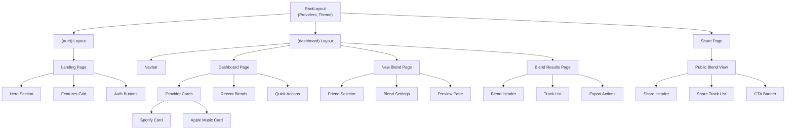

# Component Map

## Page Structure (App Router)

```
app/
├── (auth)/
│   ├── login/
│   │   └── page.tsx                 # Landing page with auth options
│   └── logout/
│       └── page.tsx                  # Logout confirmation
├── (dashboard)/
│   ├── layout.tsx                    # Dashboard layout wrapper
│   ├── page.tsx                      # Main dashboard
│   ├── blend/
│   │   ├── [id]/
│   │   │   └── page.tsx             # Blend results page
│   │   └── new/
│   │       └── page.tsx             # Create new blend
│   └── settings/
│       └── page.tsx                  # User settings
├── api/
│   ├── auth/
│   │   ├── spotify/
│   │   │   ├── route.ts             # Spotify OAuth initiation
│   │   │   └── callback/
│   │   │       └── route.ts         # Spotify OAuth callback
│   │   └── apple/
│   │       ├── route.ts             # Apple Music auth initiation
│   │       └── callback/
│   │           └── route.ts         # Apple Music callback
│   ├── blend/
│   │   ├── route.ts                 # Create blend
│   │   └── [id]/
│   │       ├── route.ts             # Get blend details
│   │       └── join/
│   │           └── route.ts         # Join existing blend
│   ├── tracks/
│   │   └── top/
│   │       └── route.ts             # Get user's top tracks
│   └── user/
│       └── route.ts                 # User profile operations
├── layout.tsx                        # Root layout
├── page.tsx                          # Landing/redirect logic
└── share/
    └── [code]/
        └── page.tsx                  # Public blend share page
```

## Component Tree



## Component Definitions

### Layout Components

```typescript
// components/layouts/RootLayout.tsx
interface RootLayoutProps {
  children: React.ReactNode;
}
- Theme provider wrapper
- Toast notifications container
- Global error boundary
- Analytics provider

// components/layouts/DashboardLayout.tsx  
interface DashboardLayoutProps {
  children: React.ReactNode;
}
- Auth guard (redirect if not logged in)
- Navigation bar
- Sidebar (desktop only)
- Mobile bottom nav

// components/layouts/Navbar.tsx
- Logo and brand
- User avatar dropdown
- Notification bell
- Quick create button
```

### Page Components

```typescript
// components/pages/Landing.tsx
- Hero with value prop
- Interactive demo
- Provider logos
- Sign up CTA

// components/pages/Dashboard.tsx
- Welcome message
- Provider connection status
- Recent blends grid
- Quick action buttons
- Stats overview

// components/pages/BlendNew.tsx
- Step wizard UI
- Friend search/select
- Settings configuration
- Real-time preview
- Create button

// components/pages/BlendResults.tsx
- Blend metadata header
- Participant avatars
- Track list with attribution
- Export to provider buttons
- Share link generator
```

### Feature Components

```typescript
// components/features/ProviderCard.tsx
interface ProviderCardProps {
  provider: 'spotify' | 'apple';
  connected: boolean;
  lastSync?: Date;
  onConnect: () => void;
  onDisconnect: () => void;
  onSync: () => void;
}

// components/features/TrackList.tsx
interface TrackListProps {
  tracks: Track[];
  showContributor?: boolean;
  showProvider?: boolean;
  selectable?: boolean;
  onSelect?: (tracks: Track[]) => void;
}

// components/features/BlendCard.tsx
interface BlendCardProps {
  blend: Blend;
  onClick: () => void;
  showParticipants?: boolean;
  showDate?: boolean;
}

// components/features/FriendSelector.tsx
interface FriendSelectorProps {
  onSelect: (userId: string) => void;
  maxSelections?: number;
  showRecentFriends?: boolean;
}
```

### UI Components (Shared)

```typescript
// components/ui/Button.tsx
interface ButtonProps {
  variant: 'primary' | 'secondary' | 'ghost' | 'danger';
  size: 'sm' | 'md' | 'lg';
  loading?: boolean;
  disabled?: boolean;
  fullWidth?: boolean;
}

// components/ui/Card.tsx
interface CardProps {
  title?: string;
  description?: string;
  footer?: React.ReactNode;
  hoverable?: boolean;
}

// components/ui/Modal.tsx
interface ModalProps {
  open: boolean;
  onClose: () => void;
  title: string;
  size?: 'sm' | 'md' | 'lg' | 'xl';
}

// components/ui/Avatar.tsx
interface AvatarProps {
  src?: string;
  name: string;
  size?: 'xs' | 'sm' | 'md' | 'lg';
  status?: 'online' | 'offline' | 'away';
}

// components/ui/Badge.tsx
interface BadgeProps {
  variant: 'success' | 'warning' | 'error' | 'info' | 'neutral';
  size?: 'sm' | 'md';
}

// components/ui/Skeleton.tsx
interface SkeletonProps {
  width?: string | number;
  height?: string | number;
  variant?: 'text' | 'circular' | 'rectangular';
}

// components/ui/Toast.tsx
interface ToastProps {
  message: string;
  type: 'success' | 'error' | 'warning' | 'info';
  duration?: number;
  action?: {
    label: string;
    onClick: () => void;
  };
}
```

### Provider Components

```typescript
// components/providers/AuthProvider.tsx
- Session management
- Token refresh logic
- User context

// components/providers/ThemeProvider.tsx  
- Dark/light mode toggle
- System preference detection
- Theme persistence

// components/providers/QueryProvider.tsx
- React Query configuration
- Default query options
- Error handling
```

## State Management

```typescript
// Context Structure
interface AppContext {
  auth: {
    user: User | null;
    providers: {
      spotify: ConnectionStatus;
      apple: ConnectionStatus;
    };
    login: (provider: Provider) => Promise<void>;
    logout: () => Promise<void>;
  };
  
  blend: {
    current: Blend | null;
    creating: boolean;
    tracks: Track[];
    addTrack: (track: Track) => void;
    removeTrack: (trackId: string) => void;
    createBlend: (settings: BlendSettings) => Promise<Blend>;
  };
  
  ui: {
    theme: 'light' | 'dark' | 'system';
    sidebarOpen: boolean;
    toggleSidebar: () => void;
    setTheme: (theme: Theme) => void;
  };
}
```

## Route Guards

```typescript
// middleware.ts
export function middleware(request: NextRequest) {
  const token = request.cookies.get('session');
  const isAuthPage = request.nextUrl.pathname.startsWith('/login');
  const isDashboard = request.nextUrl.pathname.startsWith('/dashboard');
  
  if (!token && isDashboard) {
    return NextResponse.redirect(new URL('/login', request.url));
  }
  
  if (token && isAuthPage) {
    return NextResponse.redirect(new URL('/dashboard', request.url));
  }
}

export const config = {
  matcher: ['/dashboard/:path*', '/login'],
};
```

## Component Conventions

1. **File Naming**: PascalCase for components (Button.tsx)
2. **Folder Structure**: Group by feature, not file type
3. **Exports**: Named exports for components, default for pages
4. **Props**: Interface with Props suffix (ButtonProps)
5. **Hooks**: Custom hooks in hooks/ directory
6. **Utils**: Helper functions in lib/ directory
7. **Types**: Shared types in types/ directory
8. **Tests**: Colocated with components (.test.tsx)