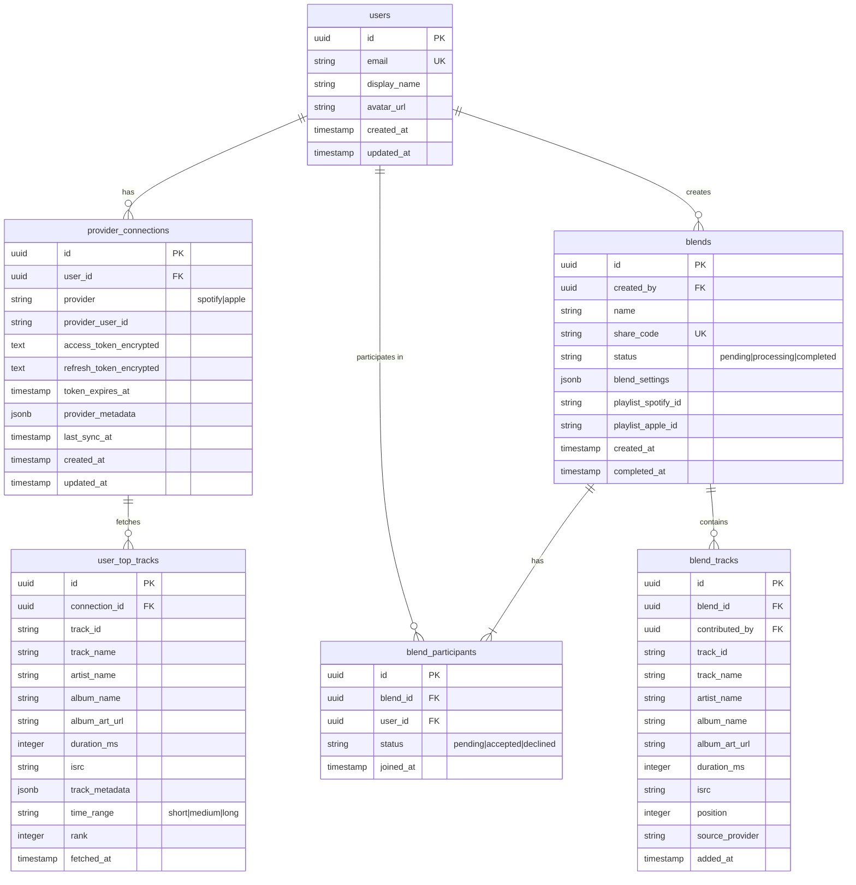

# Data Models

## Entity Relationship Diagram



## Drizzle Schema

```typescript
// db/schema/users.ts
import { pgTable, uuid, text, timestamp } from 'drizzle-orm/pg-core';

export const users = pgTable('users', {
  id: uuid('id').defaultRandom().primaryKey(),
  email: text('email').notNull().unique(),
  displayName: text('display_name'),
  avatarUrl: text('avatar_url'),
  createdAt: timestamp('created_at').defaultNow().notNull(),
  updatedAt: timestamp('updated_at').defaultNow().notNull(),
});

// db/schema/provider-connections.ts
import { pgTable, uuid, text, timestamp, jsonb, pgEnum } from 'drizzle-orm/pg-core';
import { users } from './users';

export const providerEnum = pgEnum('provider', ['spotify', 'apple']);

export const providerConnections = pgTable('provider_connections', {
  id: uuid('id').defaultRandom().primaryKey(),
  userId: uuid('user_id').references(() => users.id).notNull(),
  provider: providerEnum('provider').notNull(),
  providerUserId: text('provider_user_id').notNull(),
  accessTokenEncrypted: text('access_token_encrypted').notNull(),
  refreshTokenEncrypted: text('refresh_token_encrypted'),
  tokenExpiresAt: timestamp('token_expires_at'),
  providerMetadata: jsonb('provider_metadata'),
  lastSyncAt: timestamp('last_sync_at'),
  createdAt: timestamp('created_at').defaultNow().notNull(),
  updatedAt: timestamp('updated_at').defaultNow().notNull(),
});

// db/schema/user-top-tracks.ts
import { pgTable, uuid, text, timestamp, integer, jsonb, pgEnum } from 'drizzle-orm/pg-core';
import { providerConnections } from './provider-connections';

export const timeRangeEnum = pgEnum('time_range', ['short_term', 'medium_term', 'long_term']);

export const userTopTracks = pgTable('user_top_tracks', {
  id: uuid('id').defaultRandom().primaryKey(),
  connectionId: uuid('connection_id').references(() => providerConnections.id).notNull(),
  trackId: text('track_id').notNull(),
  trackName: text('track_name').notNull(),
  artistName: text('artist_name').notNull(),
  albumName: text('album_name'),
  albumArtUrl: text('album_art_url'),
  durationMs: integer('duration_ms'),
  isrc: text('isrc'),
  trackMetadata: jsonb('track_metadata'),
  timeRange: timeRangeEnum('time_range').notNull(),
  rank: integer('rank').notNull(),
  fetchedAt: timestamp('fetched_at').defaultNow().notNull(),
});

// db/schema/blends.ts
import { pgTable, uuid, text, timestamp, jsonb, pgEnum } from 'drizzle-orm/pg-core';
import { users } from './users';

export const blendStatusEnum = pgEnum('blend_status', ['pending', 'processing', 'completed']);

export const blends = pgTable('blends', {
  id: uuid('id').defaultRandom().primaryKey(),
  createdBy: uuid('created_by').references(() => users.id).notNull(),
  name: text('name').notNull(),
  shareCode: text('share_code').notNull().unique(),
  status: blendStatusEnum('status').default('pending').notNull(),
  blendSettings: jsonb('blend_settings').default('{}'),
  playlistSpotifyId: text('playlist_spotify_id'),
  playlistAppleId: text('playlist_apple_id'),
  createdAt: timestamp('created_at').defaultNow().notNull(),
  completedAt: timestamp('completed_at'),
});

// db/schema/blend-participants.ts
import { pgTable, uuid, timestamp, pgEnum } from 'drizzle-orm/pg-core';
import { blends } from './blends';
import { users } from './users';

export const participantStatusEnum = pgEnum('participant_status', ['pending', 'accepted', 'declined']);

export const blendParticipants = pgTable('blend_participants', {
  id: uuid('id').defaultRandom().primaryKey(),
  blendId: uuid('blend_id').references(() => blends.id).notNull(),
  userId: uuid('user_id').references(() => users.id).notNull(),
  status: participantStatusEnum('status').default('pending').notNull(),
  joinedAt: timestamp('joined_at'),
});

// db/schema/blend-tracks.ts
import { pgTable, uuid, text, integer, timestamp } from 'drizzle-orm/pg-core';
import { blends } from './blends';
import { users } from './users';

export const blendTracks = pgTable('blend_tracks', {
  id: uuid('id').defaultRandom().primaryKey(),
  blendId: uuid('blend_id').references(() => blends.id).notNull(),
  contributedBy: uuid('contributed_by').references(() => users.id).notNull(),
  trackId: text('track_id').notNull(),
  trackName: text('track_name').notNull(),
  artistName: text('artist_name').notNull(),
  albumName: text('album_name'),
  albumArtUrl: text('album_art_url'),
  durationMs: integer('duration_ms'),
  isrc: text('isrc'),
  position: integer('position').notNull(),
  sourceProvider: text('source_provider').notNull(),
  addedAt: timestamp('added_at').defaultNow().notNull(),
});

// db/schema/index.ts
export * from './users';
export * from './provider-connections';
export * from './user-top-tracks';
export * from './blends';
export * from './blend-participants';
export * from './blend-tracks';
```

## Key Design Decisions

### Token Encryption
- Access and refresh tokens are encrypted at rest using AES-256-GCM
- Encryption keys stored in environment variables
- Tokens never exposed in client-side code

### ISRC for Cross-Platform Matching
- International Standard Recording Code used to match tracks across Spotify and Apple Music
- Fallback to fuzzy matching on track name + artist if ISRC unavailable

### Flexible Metadata Storage
- JSONB columns for provider-specific data that doesn't fit core schema
- Allows storing platform-specific features without schema changes

### Time Range Strategy
- Cache top tracks for each time range (short/medium/long term)
- Refresh data if older than 24 hours
- Reduces API calls while keeping data fresh

### Blend Processing
- Status field tracks blend lifecycle
- Async processing allows for complex matching algorithms
- Share codes enable easy friend invites without exposing user IDs

### Row Level Security (RLS)
- Users can only see their own connections and tracks
- Blend participants can see blend details and tracks
- Public can view completed blend summaries via share code

## Indexes

```sql
-- Performance indexes
CREATE INDEX idx_provider_connections_user_id ON provider_connections(user_id);
CREATE INDEX idx_user_top_tracks_connection_id ON user_top_tracks(connection_id);
CREATE INDEX idx_blend_participants_blend_id ON blend_participants(blend_id);
CREATE INDEX idx_blend_participants_user_id ON blend_participants(user_id);
CREATE INDEX idx_blend_tracks_blend_id ON blend_tracks(blend_id);
CREATE INDEX idx_blends_share_code ON blends(share_code);

-- Composite indexes for common queries
CREATE INDEX idx_user_top_tracks_connection_time_range ON user_top_tracks(connection_id, time_range);
CREATE INDEX idx_provider_connections_user_provider ON provider_connections(user_id, provider);
```