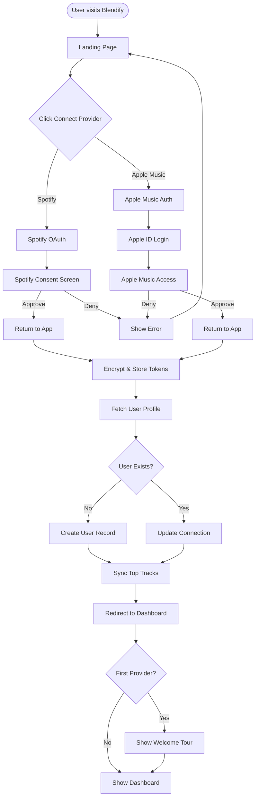
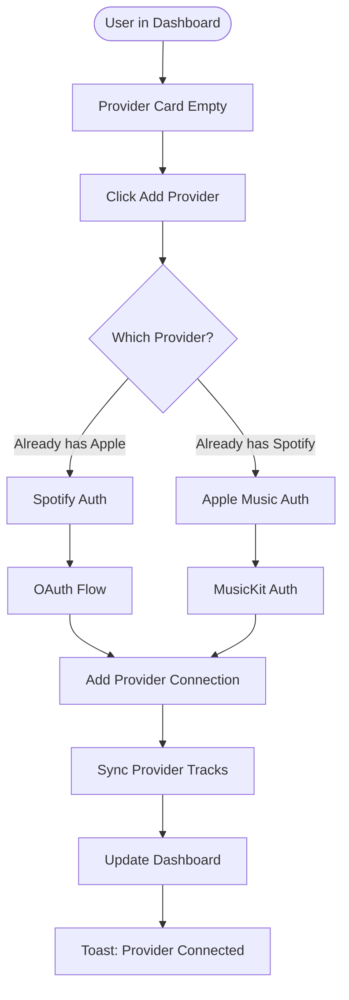
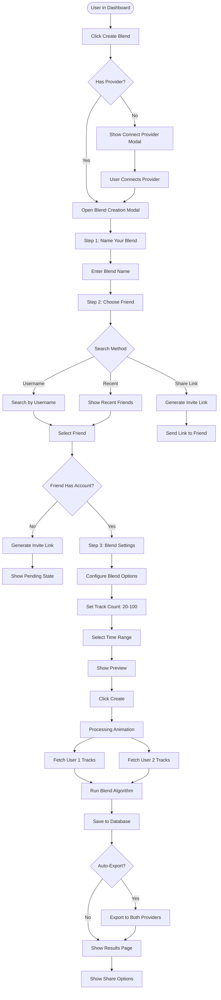
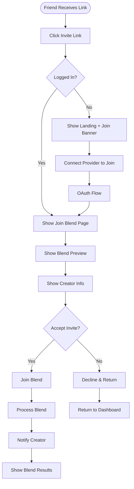
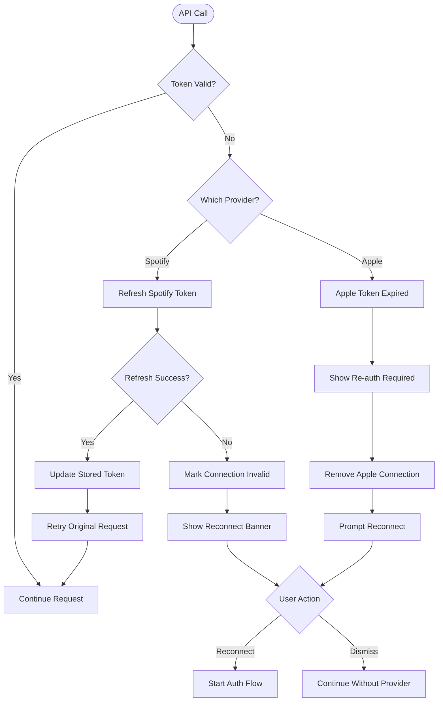
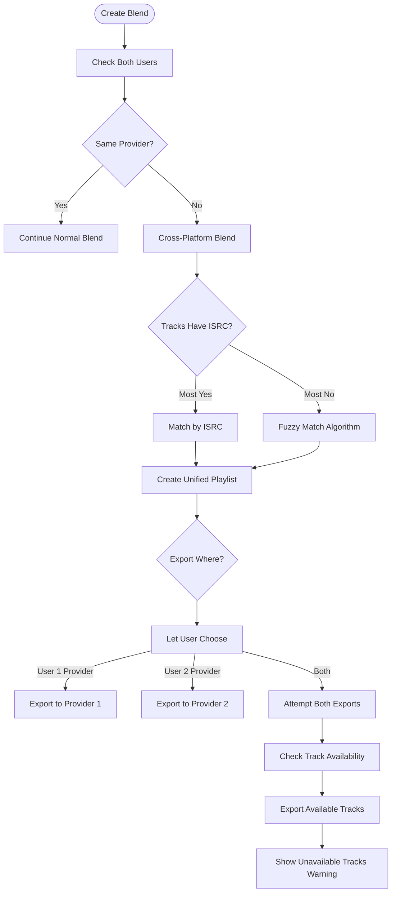
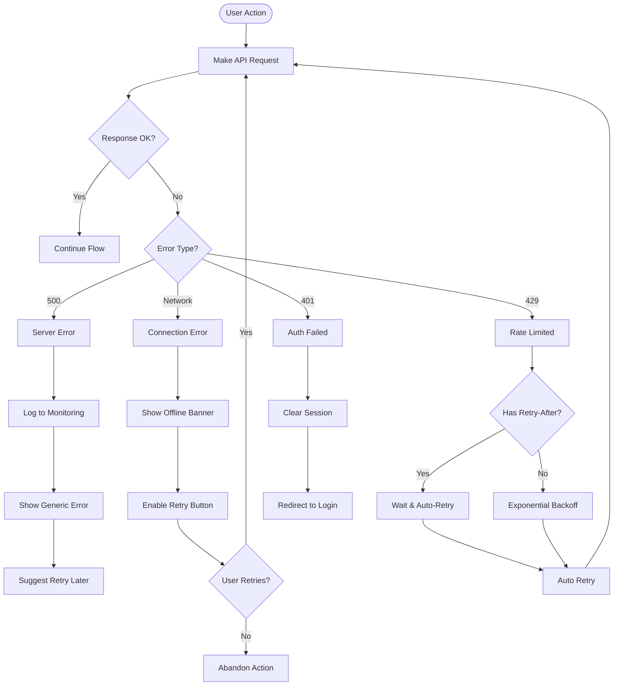
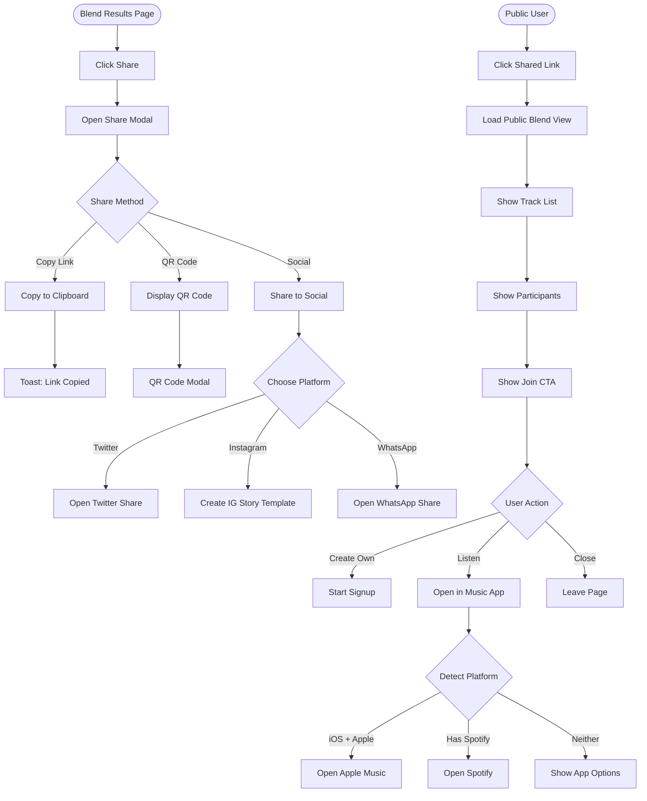
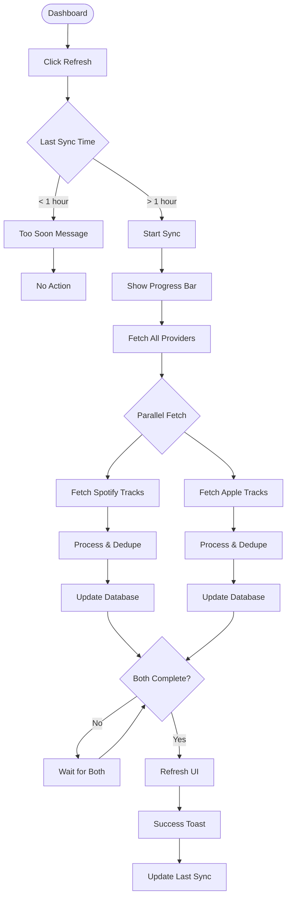
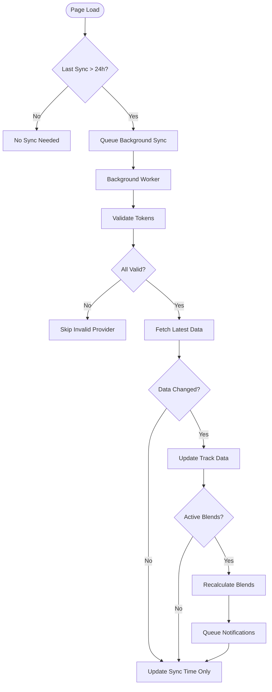

# User Flows

## 1. Account Connect Flow

### First-Time User Journey

### Returning User Connect Second Provider

## 2. Blend Creation Flow

### Standard Blend Flow

### Join Blend Flow (Via Invite Link)

## 3. Edge Cases & Error States

### Token Expiration Handling

### Provider Mismatch

### Network & API Failures

## 4. Share & Discovery Flow

### Public Blend Sharing

## 5. Data Sync & Refresh Flow

### Manual Refresh

### Background Auto-Sync

## Key UX Principles

1. **Progressive Disclosure**: Don't overwhelm new users, reveal features gradually
2. **Optimistic UI**: Show success states immediately, handle errors gracefully
3. **Clear Feedback**: Every action has immediate visual feedback
4. **Smart Defaults**: Pre-select sensible options (medium-term tracks, 50 songs)
5. **Forgiving Actions**: Allow undo/edit for non-destructive operations
6. **Accessible States**: Clear loading, error, empty, and success states
7. **Mobile-First**: Touch-friendly targets, swipe gestures where appropriate
8. **Performance Perception**: Show skeletons, progressive loading, instant interactions